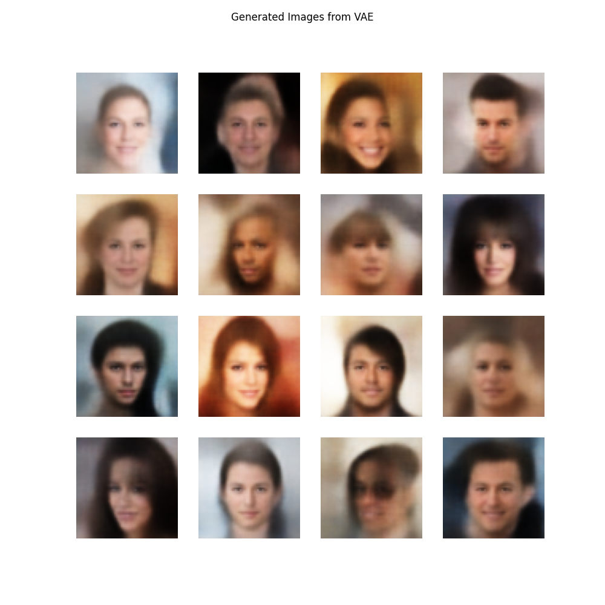
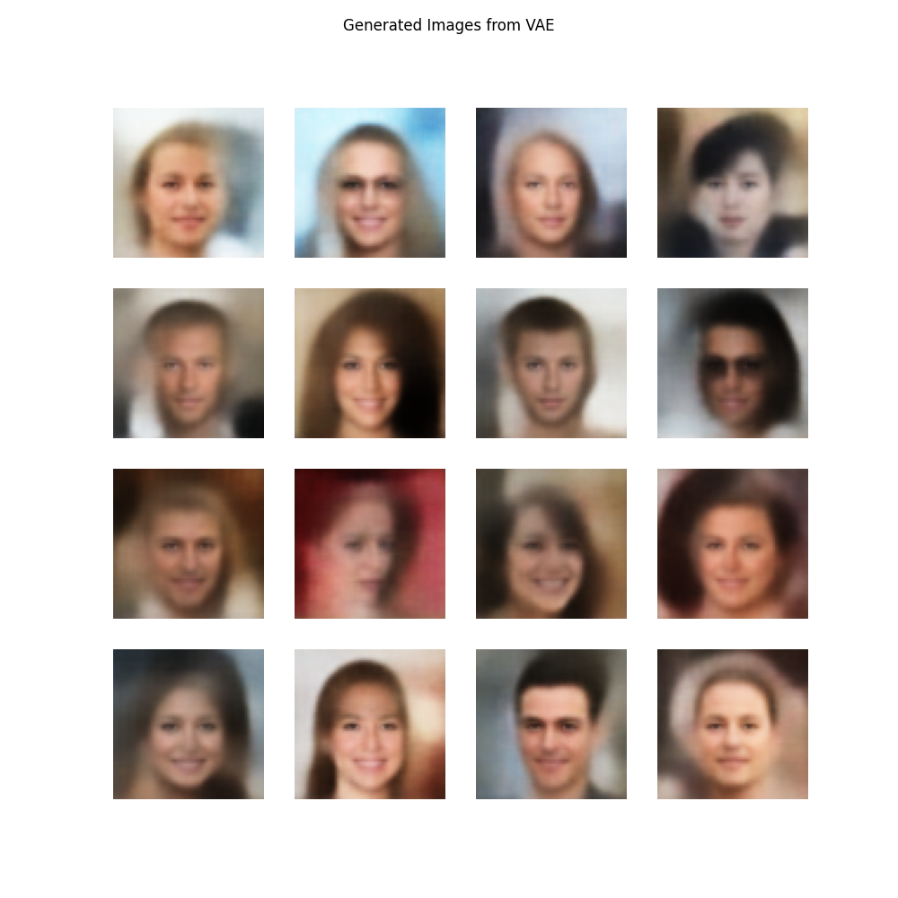
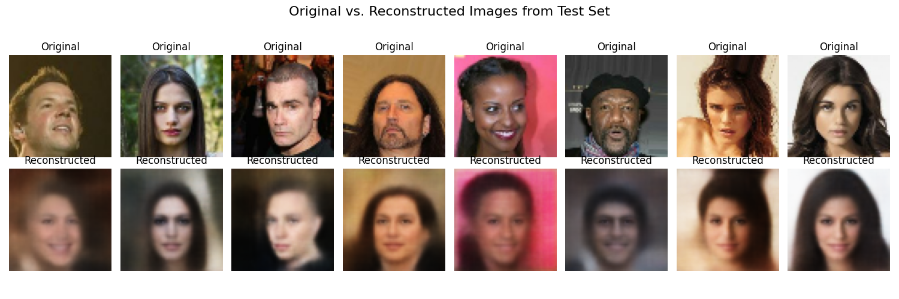
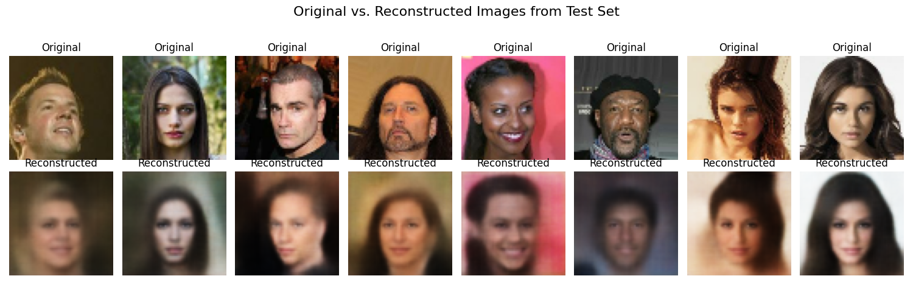
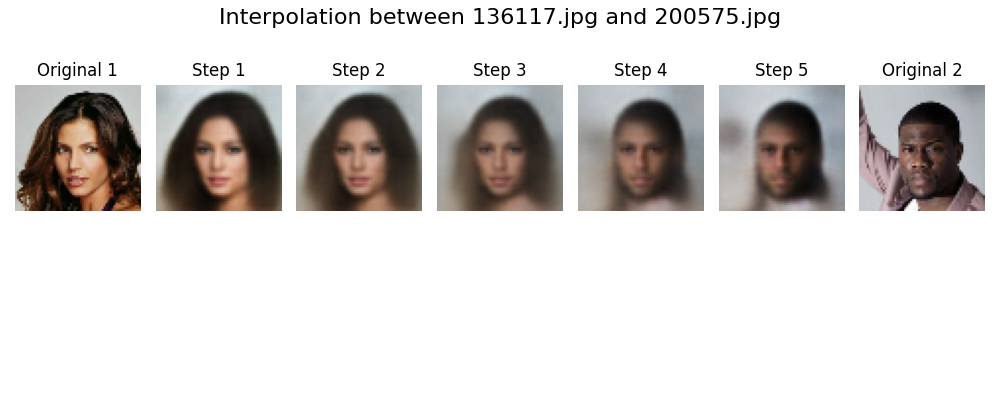
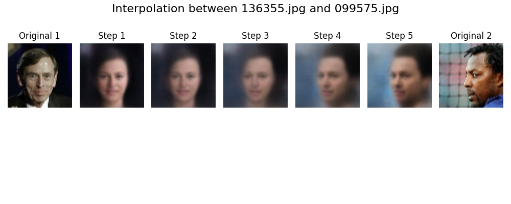

Modern Methods in Machine Learning Project
==========================================

Implements a VAE for the CelebA dataset

*Examles of Generation*

 | 

*Examles of Recontruction*

 | 

*Examles of Interpolation*

 | 
