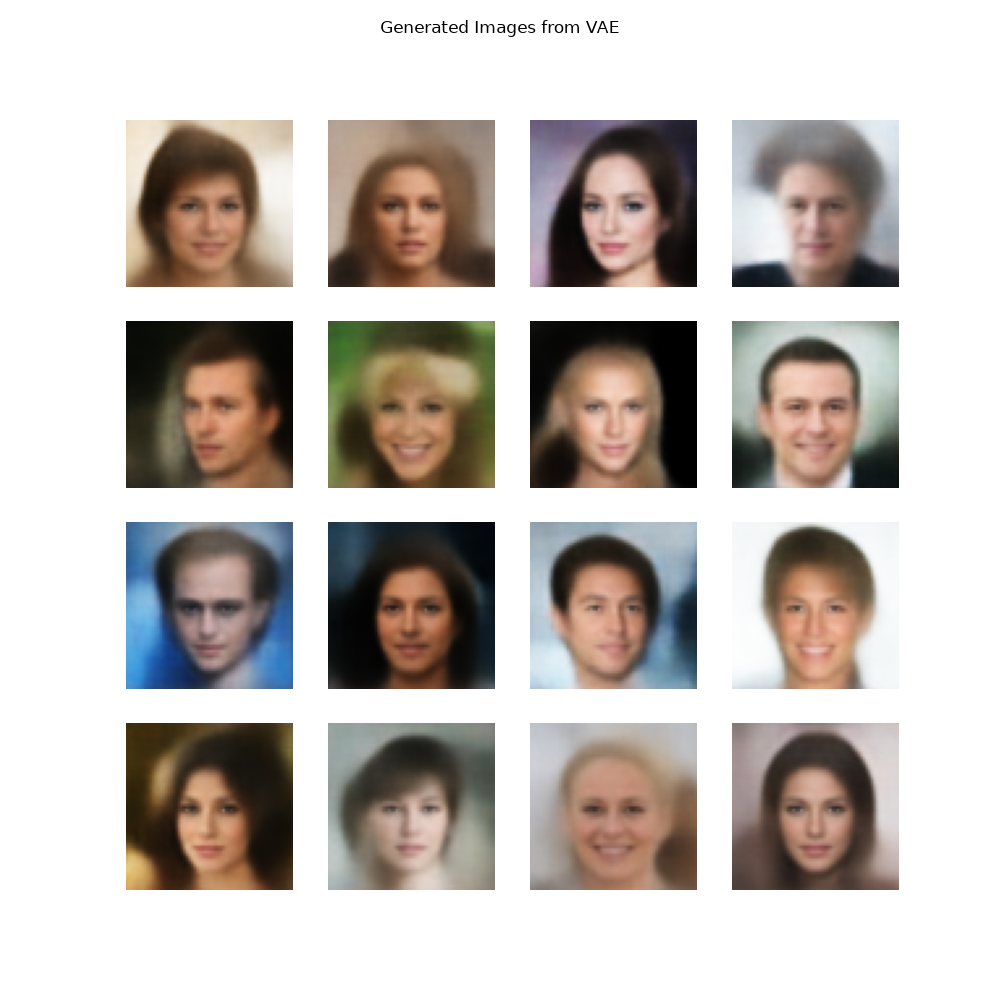
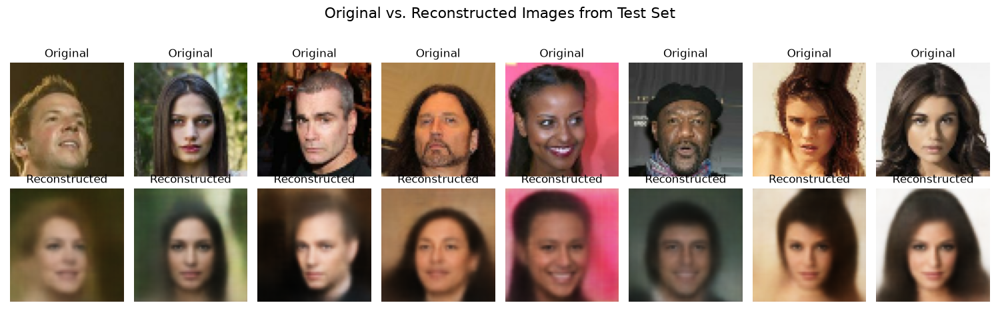
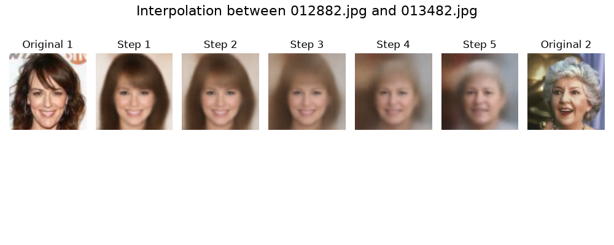

# Final Project for Modern Methods in Machine Learning

A Variational Autoencoder (VAE) was trained on the CelebA dataset. The gotten parameters were then used to generate images from random latent vectors. The VAE was also
utilized to reconstruct images from the test dataset. Additionally, latent space linear interpolation between two image was performed.

## Model Architecture

The VAE consists of:
1. Encoder with three convolutional and two dense layers
2. Latent space with dimension 128
3. Decoder with two dense and three up-scaling layers.

## Training

The model was trained and validated, 80/20 split, using the entire [CelebA dataset](https://mmlab.ie.cuhk.edu.hk/projects/CelebA.html), specifically the *Align&Cropped Images*.
The training was done in 35 epochs with a batch sizes of 128 and a learning rate of 1e-3.

## The Results

### Image Generation

### Image Reconstruction

### Image Interpolation

